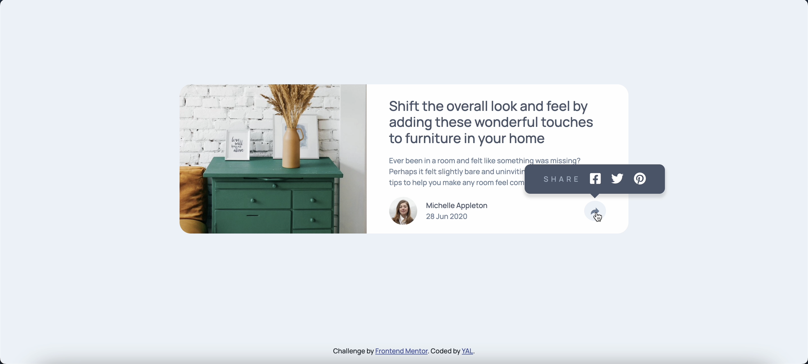

# Frontend Mentor - Article preview component solution

This is a solution to the [Article preview component challenge on Frontend Mentor](https://www.frontendmentor.io/challenges/article-preview-component-dYBN_pYFT). Frontend Mentor challenges help you improve your coding skills by building realistic projects. 

## Table of contents

- [Overview](#overview)
  - [The challenge](#the-challenge)
  - [Screenshot](#screenshot)
  - [Links](#links)
- [My process](#my-process)
  - [Built with](#built-with)
  - [What I learned](#what-i-learned)
  - [Continued development](#continued-development)
  - [Useful resources](#useful-resources)
- [Author](#author)
- [Acknowledgments](#acknowledgments)

## Overview
### The challenge
Users should be able to:
- View the optimal layout for the component depending on their device's screen size
- See the social media share links when they click the share icon

### Screenshot


### Links
- Live Site URL: 

## My process
### Built with
- Semantic HTML5 markup
- CSS custom properties
- Flexbox
- Bootstrap
- jQuery

### What I learned
在做popover的時候，原本要用bootstrap寫好的功能，但是因為彈出框裡面的自定義元素太多，所以決定還是找一個純css來寫。
最後寫js的時候，要去思考斷點在991px以下時，怎樣才會觸發對的動作，寫出了條件式。

```html
<section class="share-section d-none">
  <div class="share-content popover-active">
  <!-- ...ellipsis... -->
  </div>
</section>
```
```css
.popover-active::after {
    position: absolute;
    z-index: 1;
    content: "";
    right: calc(50% - 10px);
    bottom: -18px;
    border-style: solid;
    border-width: 10px;
    border-color: hsl(217, 19%, 35%) transparent transparent;
}
```
```js
$(".avatar-btn").click(function () {
    $(".share-section").toggleClass("d-none d-inline-block");
})

$(".avatar-btn").click(function () {
    if ($(window).width() <= 991) {
        $(".share-content").removeClass("popover-active");
        // ...ellipsis...
    }
})
```

### Continued development
js event

### Useful resources
- [Popover - pure CSS](https://codepen.io/mihaeltomic/pen/PqxVaq) - This helped me for XYZ reason. I really liked this pattern and will use it going forward.
- [jQuery action in responsive design](https://stackoverflow.com/questions/11387391/how-to-call-different-jquery-actions-in-responsive-design)

## Author


## Acknowledgments

